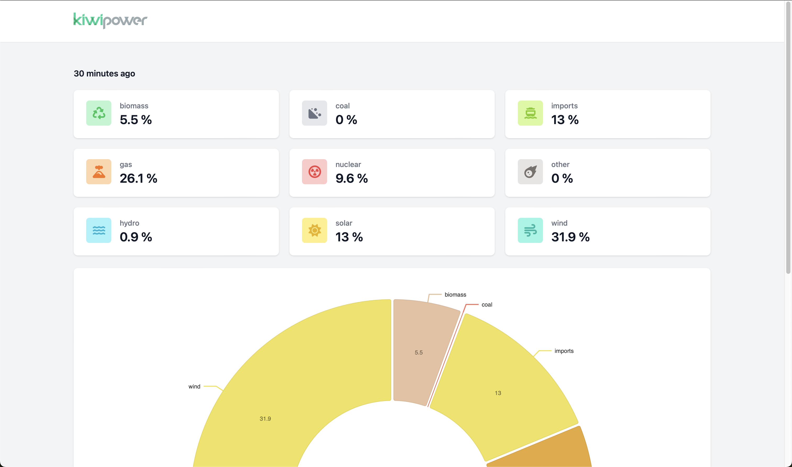

# React Offline Test

## TLDR

- This README describes the test - read it
- **Everything** you need to know is in this readme
- Definitely read the 'What are you looking for in the solution?' bit

## What is this?

We ask our JavaScript candidates to take this test as part of our recruitment process. This is step one. If we like your submission we will invite you in for (probably one) technical interview where we will have a chat and ask you to do some pair programming.

### What should it do?

Your task is to write a React application that displays the current mix of energy generation in the UK (i.e. how much nuclear, wind, solar etc.).

We have provided an empty React app to get you started - it is pre-configured with Babel and Webpack to get you up and running with no fuss. Details of an API that you can call to load the data that you should display are provided below.

### How should it work?

Definitely using React!

How you decide to load and show the data is entirely up to you.
You are free to use any libraries that you want (via `npm`) and you can choose how you wish to display the data. Some suggestions are:

- Huge numbers
- Tiled icons and numbers
- A chart of some kind
- Relative sized colour bands in a giant unicorn's rainbow puke

## Getting started

- If you haven't already, fork our GitHub project
- Get the dependencies - `npm install`
- Run the app - `npm start` - it will be available at http://localhost:8080
- Write your code, starting with [`app.tsx`](./src/app.tsx)

### Where can I find the UK energy generation data?

Here: https://api.carbonintensity.org.uk/generation

An example response is in `example_api_response.json`, where you can see that the data includes the relative percentage values of a variety of fuels
for 1 settlement period (half hour block). A live call to the API will give you the data for the latest complete settlement period. This is absolutely fine for the purposes of this test - _you do not need to worry about any larger time periods_.

An existing website that shows this data is here: https://gridwatch.co.uk/

### What are you looking for in the solution?

- A **simple**, **readable**, **well-factored** solution - not the fanciest charting library or middleware components you can find
- **Automated tests**
- Some form of visual styling - we don't care what technology you use for this but an un-styled `ul` is not going to cut it

### Anything else I should know?

- You can use any JavaScript features
- You can use TypeScript if you prefer (the project is already configured for this)
- You can use any libraries that you want
- `npm start` will start a Webpack hot-reload dev server so you can make live changes
- We really like TDD
- We like TypeScript too
- We like simplicity - a more complicated solution is rarely better than a simple one
- Some types of chart seem like a really obvious fit but are not actually very good at showing small values in a data set

## Finishing

- If you have made any changes that require us to do more than just an `npm install` and `npm start` to run your solution then please make this clear in the readme
- Let your agent know that you're done and we will take a look at your fork in GitHub (no pull requests please)
